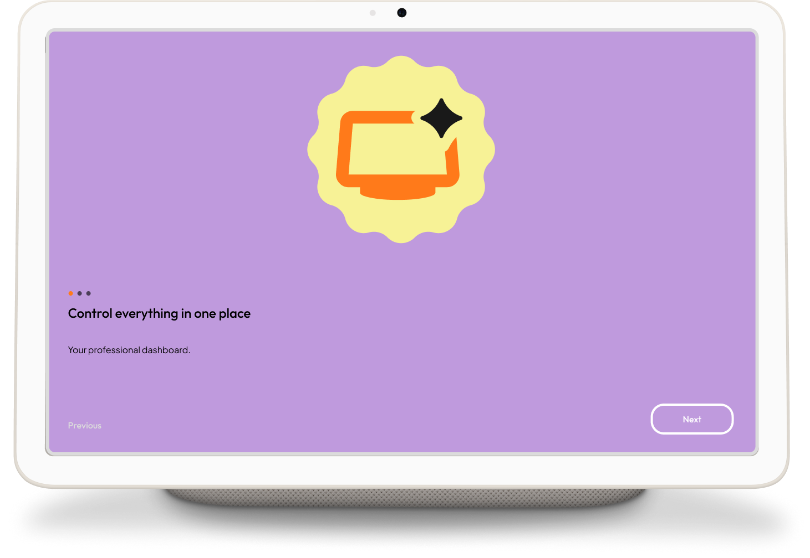
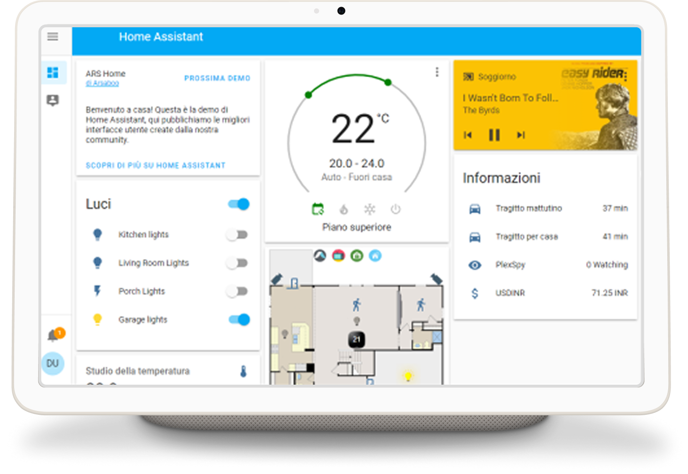

# Kite

## Overview

**Kite AOS** is a modern, open-source Android kiosk application designed to transform tablets into
dedicated smart home dashboards. While optimized for Home Assistant, it is
designed for any use case requiring a persistent, locked-down web-view interface (e.g., industrial
panels,
information kiosks, or dedicated web-resource controllers).

Originally developed to solve my personal smart home setup needs, the platform is highly modular.
I'm always open to discussions and feature requests to expand its capabilities. Feel free to open an
issue!

<p align="center">
  
  
</p>

## Core Features

* **Versatile Web Kiosk:** Display any web-based interface in a full-screen, locked-down
  environment.
* **Motion-Aware Intelligence:** Automatic display wake-up via CameraX (Luma analysis), eliminating
  external hardware requirements.
* **MQTT & HA Discovery:** Seamless integration with Home Assistant. Device state, battery, and
  motion data are exposed automatically.
* **Clean Architecture:** A modular system comprising 40+ independent modules for maximum
  scalability.
* **Kiosk Lockdown:** Full restriction of navigation gestures, status bars, and system
  notifications.

## Functional Capabilities

| Feature                 | Description                                                                                |
|:------------------------|:-------------------------------------------------------------------------------------------|
| **Control Drawer**      | Side panel (Haze blur) for WebView navigation control and a launcher for whitelisted apps. |
| **Hardware Management** | Automated screen dimming and forced locking after periods of inactivity.                   |
| **Onboarding Wizard**   | Step-by-step configuration for system permissions and MQTT connectivity.                   |

## Technical Specifications

* **Framework:** Jetpack Compose for the native UI layer.
* **State Management:** Orbit MVI.
* **Persistence:** Proto DataStore for atomic, thread-safe configuration.
* **Dependency Injection:** Koin.
* **Image Processing:** Background-threaded Luma analysis for motion detection.
* **Build System:** Gradle Convention Plugins for centralized build logic.

## Installation & Deployment

### Prerequisites

* Android Studio Ladybug or newer
* JDK 21
* Android Device (API level 26+)

### Build Instructions

```bash
# Clone the repository
git clone [https://github.com/andrew-malitchuk/kite.git](https://github.com/andrew-malitchuk/kite.git)

# Generate debug APK
./gradlew assembleDebug
```

### Setup

1. Deploy the APK to the target device.
2. Complete the initial configuration wizard to grant system-level permissions.
3. Configure the dashboard URL and MQTT broker credentials.

## Roadmap

__JTBD:__

## Feedback & Feature Requests

If you have ideas for new features or encounter issues, please open an issue in the repository to
suggest improvements.

## Troubleshooting

Check out the troubleshooting section for common problems
and solutions. If you still need assistance, feel free to reach out support.

## Contributing

Contributions are welcome. Please follow the standard pull request process:

1. Fork the repository.
2. Create a feature branch.
3. Submit a PR with a detailed description of changes.

This project started as a personal tool to cover my specific use cases. If you need functionality
that isn't currently supported, let's discuss it in the Issues section before submitting a PR.

---

Built with Jetpack Compose, Koin, and Orbit MVI.

## License

Apache 2.0 License

```
Copyright (c) [2026] [Andrew Malitchuk]

Licensed under the Apache License, Version 2.0 (the "License");
you may not use this file except in compliance with the License.
You may obtain a copy of the License at

    http://www.apache.org/licenses/LICENSE-2.0

Unless required by applicable law or agreed to in writing, software
distributed under the License is distributed on an "AS IS" BASIS,
WITHOUT WARRANTIES OR CONDITIONS OF ANY KIND, either express or implied.
See the License for the specific language governing permissions and
limitations under the License.
```